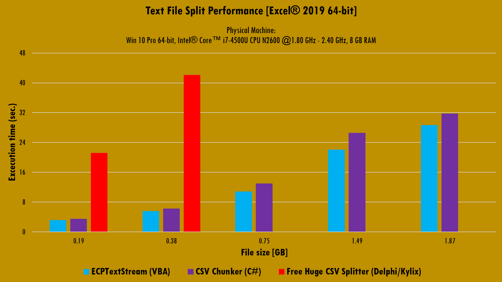

# Simple CSV and Text files Splitter
{: .fs-9 }

The ECPTextStream class module can be used for a variety of purposes. In this section, I will share with you a simple Workbook project that can split big CSV and Text files into chunks with a specified number of lines. 

The cited functionality has been well discussed over the internet but, however, there are ways to improve any solution given on. Although VBA is known as a low speed language, the programmer can use some tools to explote all its potential.

The tool covered here, which can be downloaded [from this link](https://github.com/ws-garcia/ECPTextStream/raw/main/test-assets/Split_Text_Files.xlsm), was tested against other two software. In each test the original CSV file was sliced into four (4) pieces and the first line, of the source file, was repeated in each output file when this option was available. The solutions tested were:

- [CSV Chunker](http://www.scaled-solutions.com/sites/default/files/CSV%20Chunker.zip), written in C#.
- [Free Huge CSV Splitter](https://sourceforge.net/projects/splitcsv/), written in Delphi/Kylix.

The image below shows the benchmark for the test.

As we can see, the performance limitations of VBA can be mitigated when proper techniques are used to perform a certain task. By its way, the [Free Huge CSV Splitter](https://sourceforge.net/projects/splitcsv/) expenses more than 90 seconds to split the 0.75 GB file.
